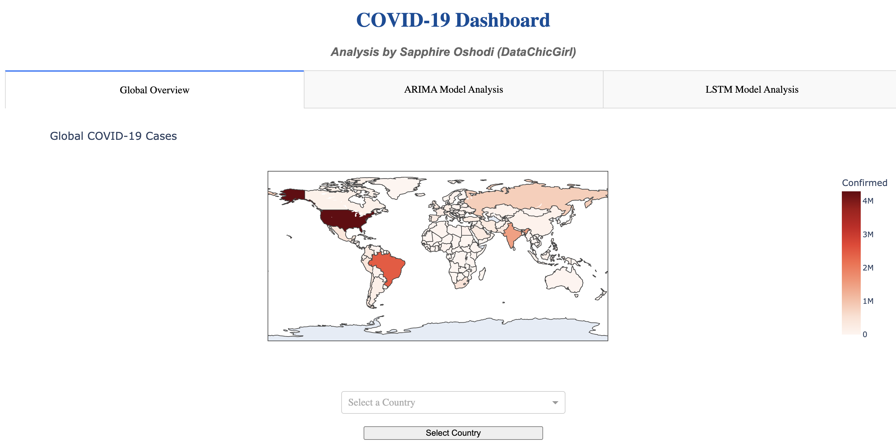
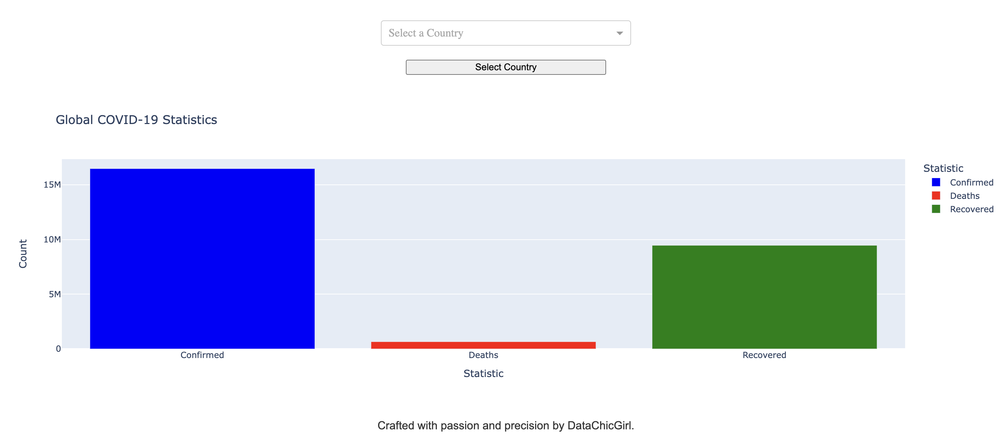

# Covid19-Predictive-Dashboard  

COVID-19 Forecasting and Analysis Dashboard: This project features a web dashboard for visualizing and predicting COVID-19 trends using ARIMA and LSTM models. It includes interactive graphs and statistics for global and country-level cases, deaths, and recoveries.


## Live App  
[](https://covid19-predictive-dashboard-app.onrender.com)  
Access the live dashboard here: [https://covid19-predictive-dashboard-app.onrender.com/](https://covid19-predictive-dashboard-app.onrender.com/)


## Features  
- Interactive global COVID-19 case map.  
- ARIMA-based time series forecasting.  
- Country-specific data visualization.  


## Preview  
  
  

*Example of the interactive COVID-19 dashboard.*


## Installation  
To run this project locally:  

1. Clone the repository:
   ```bash
   git clone https://github.com/your-username/Covid19-Predictive-Dashboard.git
   cd Covid19-Predictive-Dashboard
   ```
2. Install dependencies:
   ```bash
   pip install -r requirements.txt
   ```
3. Run the app:
   ```bash
   python app.py
   ```
4. Open the app in your browser at `http://127.0.0.1:8050/`.

**Note:** Ensure the required datasets (`country_wise_latest.csv`, `day_wise.csv`) are in the correct paths.


## Technical Details  
- **ARIMA Model**: Used for time series forecasting of COVID-19 cases based on historical data.  
- **LSTM Model**: Employed for predicting trends using sequential data.  
- **Dashboard Framework**: Built using [Dash](https://dash.plotly.com/).  
- **Data Sources**: The datasets were obtained from [Johns Hopkins University](https://github.com/CSSEGISandData/COVID-19).  


## Acknowledgements  
- [Dash by Plotly](https://dash.plotly.com/) for the dashboard framework.  
- [Statsmodels](https://www.statsmodels.org/stable/index.html) for ARIMA modeling.  
- [Kaggle](https://www.kaggle.com/) for the COVID-19 datasets.  


## License  
This project is licensed under the MIT License - see the [LICENSE](LICENSE) file for details.  


## Badges  
[](https://covid19-predictive-dashboard-app.onrender.com)  
[](LICENSE)  


Let me know if you need further assistance with this setup!
